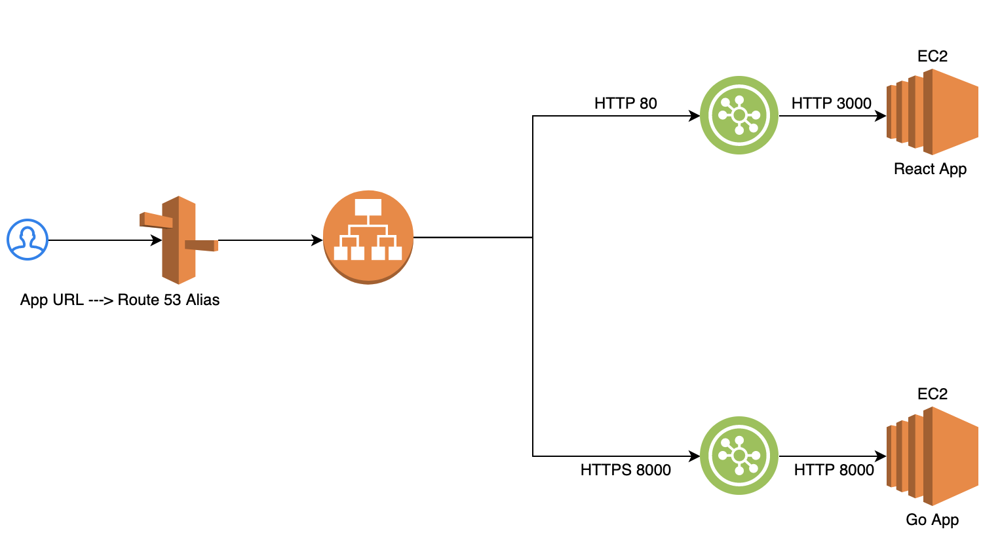

# migrate-leaves-to-xero
This is a project to automate the leave migration process i.e. migrating the leaves entered in Krow tool to Xero.

# The Problem
- Leave is entered by team members into krow and on weekly basis the Operations Team have to perform a manual extract of leave and enter into xero.
- If a person has entered leave as annual leave but does not have sufficient balance the operations team have to manually split between the paid and unpaid component
- If the leave spans 2 pay cycles then only the leave from the 1st pay cycle can be entered 
- leave cannot be entered if time sheet not approved

# MVP
- Adjusting leave balance for leave entered
- Changing leave type for when balance is insufficient
- Some type of error report for items not processed (only needs to include the lines)
- Report listing items successfully entered (can be very basic but required for auditing - important that this lists any leave where the category was changed as we need to inform the team member so they aren't surprised come payroll when a week of annual leave was changed to unpaid leave)

# Leave type mappings from Krow to Xero
| Krow Leave        | Xero Leave |
| :-------------: |:-------------:| 
| Annual Leave          | Annual Leave | 
| Compassionate Leave   | Compassionate Leave (paid) |   
| Jury Duty             | Jury Duty |    
| Parental Leave (10 days for new family member) | Parental Leave (Paid) |
| Parental Leave        | Parental Leave (Paid) |
| Personal/Carers Leave | Personal/Carer's Leave |
| Purchased Leave       | Purchased Leave |
| Unpaid Leave          | Other Unpaid Leave |

* Public Holiday is not a category in Xero as public holidays are separate from leave

# Additional Rules
* Annual Leave - allowed to go to negative 40 hours, if more than negative 40 hours leave is taken then automatically gets changed to unpaid leave.
* Personal/Carers Leave - allowed to go to negative 16 hours, if more leave is taken than - 16 hours then it automatically gets changed to unpaid leave.
* Parental Leave - if more leave is taken than available then it automatically gets changed to unpaid leave.
* Purchased Leave - if more leave is taken than available then it automatically gets changed to unpaid leave.
* Compassionate Leave - if more leave is taken than available then it automatically gets rejected.
* Jury Duty - if more leave is taken than available then it automatically gets rejected.
* If a leave category is not available then it automatically gets rejected.
* All items rejected need to be clearly reported so the operations team can investigate and manually fix.
* All changes to leave type from the Krow timesheet extract to Xero need to be clearly reported, so I can message the individuals and let them know that they had insufficient leave.
* All items entered into Xero need to be reported for auditing.

# Xero OAuth Code Flow

- [Xero Auth Flow Doc](https://developer.xero.com/documentation/oauth2/auth-flow)
- [Xero API Doc](https://developer.xero.com/documentation/payroll-api/overview)

# Implementation Details
* This app is running in DigIO sandbox AWS account. Both the React frontend and the go backend is running as docker containers in the same EC2 instance.
* The `connect to Xero` button on the landing page redirects a user to the Xero login page. After successful Auth, the Auth token JSON (Valid for 30 mins) is written to the disk. The location can be changed in the .env file property AUTH_TOKEN_FILE_LOCATION.
* A React Frontend (File Upload UI) is used to upload the leave extract in .xlsx format from Krow.
* A Go Backend is used to process the leaves and apply leave in Xero.
* Error and Audit reporting is sent to operations team email address. The from and to email can be configured in .env file. (Please add and verify the email address in AWS SES Dashboard)
* Xero Auth process needs an HTTPS endpoint for the redirect URL and hence an AWS LB (Application Type) is used to route the HTTPS traffic to the Go backend running on HTTP.
* A Route53 record set (LB as Alias target) has been added to leverage the existing hosted zone `sandbox.digio.com.au`.

